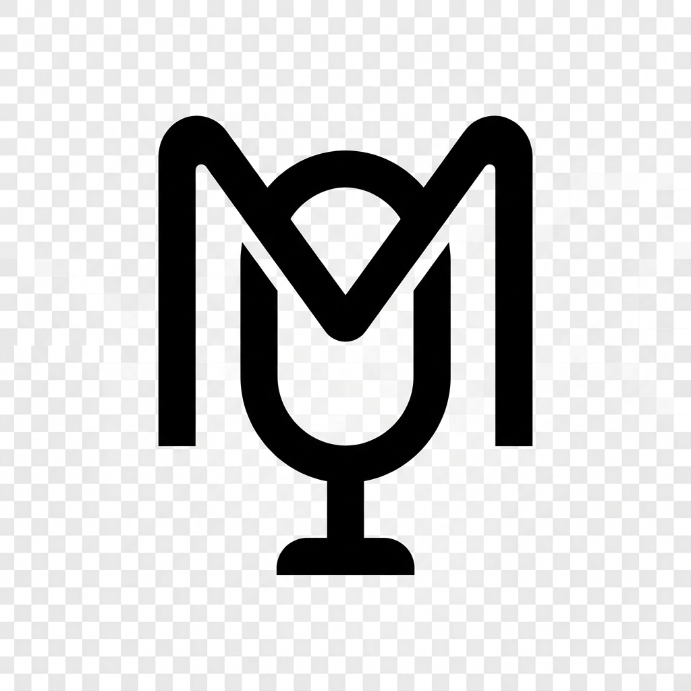

# Mycro

<p align="center">
  
</p>

<p align="center">
  <strong>AI Assistant Desktop Application</strong>
</p>

<p align="center">
  Version 0.2
</p>

---

## Overview
BETA VERSION - STILL UNDER DEVELOPMENT !!
Mycro is a desktop AI assistant application that provides intelligent conversation, context management, and various AI-powered features.

## Features

- AI-powered conversations using Ollama
- Voice input support with Whisper
- System tray integration
- Hotkey support
- Context-aware responses
- MCP (Model Context Protocol) support

## Tech Stack

- **Frontend**: React + TypeScript + Vite
- **Backend**: Electron + Node.js
- **AI**: Ollama + Whisper

## Getting Started

```bash
# Install dependencies
cd resources/app
npm install

# Run development mode
npm run dev

# Build
npm run build
```

## License

See LICENSE file for details.
